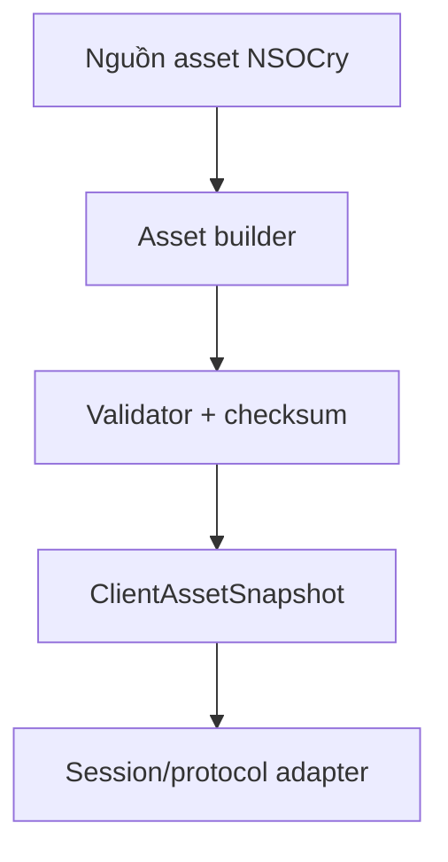

# Thiết kế asset pipeline tương thích client V7

## Mục tiêu

Tạo năm sản phẩm byte bất biến phục vụ giai đoạn sau đăng nhập:

1. appearance data nối sau bốn byte của `UPDATE_VERSION`;
2. DATA payload (`-122`);
3. MAP payload (`-121`);
4. SKILL payload (`-120`);
5. ITEM payload (`-119`).

Session không được tự truy database, đọc JSON hay ghép asset. Session chỉ lấy một `ClientAssetSnapshot` đã được build và validate.

## Nguồn tham chiếu đã kiểm kê

| Sản phẩm | Nguồn tạo trong reference | Nguồn dữ liệu chính |
|---|---|---|
| Appearance | hàm tạo version blob | head/body/leg/mount metadata |
| DATA | các bộ dựng arrow/effect/image/part/skill-paint rồi tổng hợp | bảng metadata đồ họa, task-map, EXP, bảng nâng cấp, effect template |
| MAP | bộ dựng map | map, NPC template/menu, mob template |
| SKILL | bộ dựng skill | skill option, class, skill template, level skill và option |
| ITEM | bộ dựng item | item option và item template |

Reference mặc định dùng version `26` cho cả bốn nhóm nhưng NSOCry không được phụ thuộc cứng vào số này. Version là thuộc tính của output đã build, không phải business rule.

## Contract byte cấp cao

Mỗi response DATA/MAP/SKILL/ITEM bắt đầu bằng đúng một byte version của chính nó. Phần còn lại được client parser đọc theo schema tương ứng. `UPDATE_VERSION` chứa bốn byte version trước appearance data.

Client V7 build 217 đọc số mob trong MAP bằng `short`; nhánh byte dành cho client cũ không được dùng cho client này.

## Ranh giới kiến trúc

- Builder chịu trách nhiệm chuyển domain/read model sang byte layout.
- Validator parse lại output, kiểm tra giới hạn, version và checksum.
- Snapshot giữ đồng bộ nguyên tử giữa manifest và năm payload.
- Protocol adapter chỉ chọn payload theo request command.

## Quy tắc an toàn và vận hành

- Không build asset cho từng session.
- Không query SQL trong network thread.
- Không thay riêng một payload khi bốn version/appearance chưa đồng bộ.
- Không log toàn bộ payload hoặc dữ liệu database.
- Build thất bại phải giữ snapshot cũ; không publish snapshot một phần.
- Mỗi output cần length, SHA-256, version và thời điểm build trong metadata vận hành.
- Chỉ nâng version sau khi output mới parse lại thành công.

## Trạng thái

- Inventory nguồn và contract cấp cao: VERIFIED_STATIC.
- `ClientAssetSnapshot` và provider port: IMPLEMENTED, chờ Maven verification.
- Builder DATA/MAP/SKILL/ITEM/appearance: chưa triển khai.
- Runtime integration: chưa triển khai.

## Bước tiếp theo

Chốt byte layout chi tiết của ITEM trước vì đây là payload nhỏ và độc lập nhất. Viết model read-only, encoder và parser test đối xứng; sau đó làm SKILL, MAP, DATA và appearance theo thứ tự độ phức tạp tăng dần.

## ITEM byte layout đã chốt

| Thứ tự | Kiểu | Nội dung |
|---:|---|---|
| 1 | `byte` | item version |
| 2 | `unsigned byte` | số item option template |
| 3 | lặp option | `UTF name`, `byte type` |
| 4 | `unsigned short` | số item template |
| 5 | lặp item | `byte type`, `byte gender`, `UTF name`, `UTF description`, `byte level`, `short icon`, `short part`, `boolean upgradable` |

`ItemAssetBundle` là read model riêng cho client. Nó không phải entity vật phẩm gameplay và không chứa giá, số lượng sở hữu, chỉ số ngẫu nhiên hoặc trạng thái người chơi.
