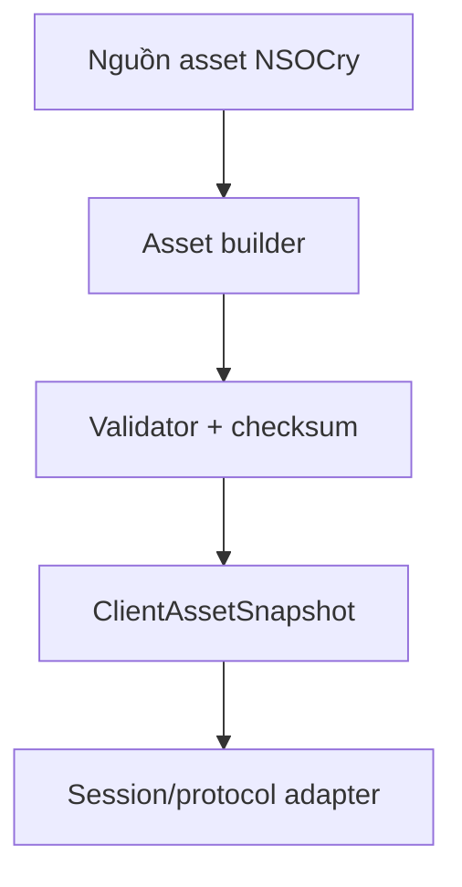

# Thiết kế asset pipeline tương thích client V7

## Mục tiêu

Tạo năm sản phẩm byte bất biến phục vụ giai đoạn sau đăng nhập:

1. appearance data nối sau bốn byte của `UPDATE_VERSION`;
2. DATA payload (`-122`);
3. MAP payload (`-121`);
4. SKILL payload (`-120`);
5. ITEM payload (`-119`).

Session không được tự truy database, đọc JSON hay ghép asset. Session chỉ lấy một `ClientAssetSnapshot` đã được build và validate.

## Nguồn tham chiếu đã kiểm kê

| Sản phẩm | Nguồn tạo trong reference | Nguồn dữ liệu chính |
|---|---|---|
| Appearance | hàm tạo version blob | head/body/leg/mount metadata |
| DATA | các bộ dựng arrow/effect/image/part/skill-paint rồi tổng hợp | bảng metadata đồ họa, task-map, EXP, bảng nâng cấp, effect template |
| MAP | bộ dựng map | map, NPC template/menu, mob template |
| SKILL | bộ dựng skill | skill option, class, skill template, level skill và option |
| ITEM | bộ dựng item | item option và item template |

Reference mặc định dùng version `26` cho cả bốn nhóm nhưng NSOCry không được phụ thuộc cứng vào số này. Version là thuộc tính của output đã build, không phải business rule.

## Contract byte cấp cao

Mỗi response DATA/MAP/SKILL/ITEM bắt đầu bằng đúng một byte version của chính nó. Phần còn lại được client parser đọc theo schema tương ứng. `UPDATE_VERSION` chứa bốn byte version trước appearance data.

Client V7 build 217 đọc số mob trong MAP bằng `short`; nhánh byte dành cho client cũ không được dùng cho client này.

## Ranh giới kiến trúc

- Builder chịu trách nhiệm chuyển domain/read model sang byte layout.
- Validator parse lại output, kiểm tra giới hạn, version và checksum.
- Snapshot giữ đồng bộ nguyên tử giữa manifest và năm payload.
- Protocol adapter chỉ chọn payload theo request command.

## Quy tắc an toàn và vận hành

- Không build asset cho từng session.
- Không query SQL trong network thread.
- Không thay riêng một payload khi bốn version/appearance chưa đồng bộ.
- Không log toàn bộ payload hoặc dữ liệu database.
- Build thất bại phải giữ snapshot cũ; không publish snapshot một phần.
- Mỗi output cần length, SHA-256, version và thời điểm build trong metadata vận hành.
- Chỉ nâng version sau khi output mới parse lại thành công.

## Trạng thái

- Inventory nguồn và contract cấp cao: VERIFIED_STATIC.
- `ClientAssetSnapshot` và provider port: IMPLEMENTED, chờ Maven verification.
- Builder DATA/MAP/SKILL/ITEM/appearance: chưa triển khai.
- Runtime integration: chưa triển khai.

## Bước tiếp theo

Chốt byte layout chi tiết của ITEM trước vì đây là payload nhỏ và độc lập nhất. Viết model read-only, encoder và parser test đối xứng; sau đó làm SKILL, MAP, DATA và appearance theo thứ tự độ phức tạp tăng dần.

## ITEM byte layout đã chốt

| Thứ tự | Kiểu | Nội dung |
|---:|---|---|
| 1 | `byte` | item version |
| 2 | `unsigned byte` | số item option template |
| 3 | lặp option | `UTF name`, `byte type` |
| 4 | `signed short` | số item template, giới hạn 0–32767 |
| 5 | lặp item | `byte type`, `byte gender`, `UTF name`, `UTF description`, `byte level`, `short icon`, `short part`, `boolean upgradable` |

`ItemAssetBundle` là read model riêng cho client. Nó không phải entity vật phẩm gameplay và không chứa giá, số lượng sở hữu, chỉ số ngẫu nhiên hoặc trạng thái người chơi.

## SKILL byte layout đã chốt

1. `byte version`.
2. `signed byte option-template count`, lặp `UTF option name`.
3. `unsigned byte class count`.
4. Mỗi class: `UTF name`, `signed byte template count`.
5. Mỗi template: `byte id`, `UTF name`, `byte maxPoint`, `byte type`, `short icon`, `UTF description`, `signed byte level count`.
6. Mỗi level: `short id`, `byte point`, `byte requiredLevel`, `short manaUse`, `int coolDown`, `short dx`, `short dy`, `byte maxFight`, `signed byte option count`.
7. Mỗi option: `short parameter`, `byte optionTemplateId`.

Các count mà client đọc bằng `readByte()` bị giới hạn 0–127. Class count được đọc bằng `readUnsignedByte()` nên giới hạn 0–255. Codec từ chối count vượt giới hạn trước khi ghi để tránh client cấp phát mảng với kích thước âm.

## MAP byte layout đã chốt cho client 217

1. `byte mapVersion`.
2. `unsigned byte mapCount`, lặp `UTF mapName`.
3. `signed byte npcCount`.
4. Mỗi NPC: `UTF name`, `short head`, `short body`, `short leg`, `signed byte menuRowCount`.
5. Mỗi menu row: `signed byte choiceCount`, lặp `UTF text`.
6. `signed short mobCount`.
7. Mỗi mob: `byte type`, `UTF name`, `int health`, `byte moveRange`, `byte speed`.

Payload MAP chỉ chứa template tĩnh. Zone, tọa độ người chơi, mob instance và trạng thái chiến đấu thuộc runtime gameplay, không được đưa vào `MapAssetBundle`.

## DATA container layout đã chốt

1. `byte dataVersion`.
2. Năm block theo thứ tự arrow, effect, image, part, skill-paint; mỗi block là `int length` + raw bytes.
3. `signed byte taskGroupCount`; mỗi group có `signed byte routeCount`, sau đó các cặp `byte npcId`, `byte mapId`.
4. `signed byte expCount`, lặp `long expThreshold`.
5. Mười bảng `int`: mỗi bảng có `signed byte count`, rồi các giá trị `int`.
6. Effect-template data nằm cuối payload và có schema nội bộ riêng.

Mười bảng giữ thứ tự cố định: bốn requirement, bốn coin cost, gold cost và max-percent. `DataAssetCodec` chịu trách nhiệm container; parser chi tiết năm graphics block và effect-template sẽ được tách riêng để không tạo một class khổng lồ.

## Appearance layout đã chốt

- `unsigned byte headCount`, sau đó ba group cùng count: jumping, normal, covered.
- Mỗi head/body part: descriptor `layerCount * 3 + 2`, `short id`, `short smallImage`, rồi mỗi layer gồm `short imageId`, `short dx`, `short dy`.
- `unsigned byte legCount`, mỗi leg gồm `short id`, `short smallImage`.
- `unsigned byte bodyCount`, sau đó ba group cùng count: jumping, normal, covered.
- `signed byte mountCount`; mỗi mount gồm `short itemId` và đúng sáu frame group.
- Mỗi frame group: `signed byte frameCount`, lặp `short frameId`.

Descriptor part là signed byte nên tối đa 41 layer. Ba biến thể head và ba biến thể body bắt buộc có count giống nhau vì wire chỉ gửi count một lần cho mỗi loại.

## Snapshot assembly và publish

`ClientAssetSnapshotAssembler` mã hóa đủ DATA/MAP/SKILL/ITEM/appearance trong biến cục bộ rồi mới tạo snapshot. Lỗi ở bất kỳ codec nào làm toàn bộ thao tác thất bại, không thể sinh snapshot bán phần.

`AtomicClientAssetSnapshotProvider` publish một snapshot hoàn chỉnh bằng `AtomicReference`. Session đang chạy luôn nhìn thấy snapshot cũ hoặc snapshot mới, không thấy trạng thái đang thay dở.

## Cổng nguồn và điều phối rebuild

Mỗi read model có một source port riêng: `DataAssetSource`, `MapAssetSource`,
`SkillAssetSource`, `ItemAssetSource` và `AppearanceAssetSource`. Các cổng này không
phụ thuộc JDBC nên có thể dùng implementation database, file hoặc fixture mà không đổi
tầng codec và session.

`ClientAssetSnapshotBuildService` đọc đủ năm nguồn, gọi assembler rồi mới publish qua
`ClientAssetSnapshotPublisher`. Nếu một nguồn trả lỗi, trả `null` hoặc codec từ chối dữ
liệu thì snapshot hiện hành được giữ nguyên. JDBC adapter ở giai đoạn sau chỉ hiện thực
các source port; session tuyệt đối không gọi JDBC.
