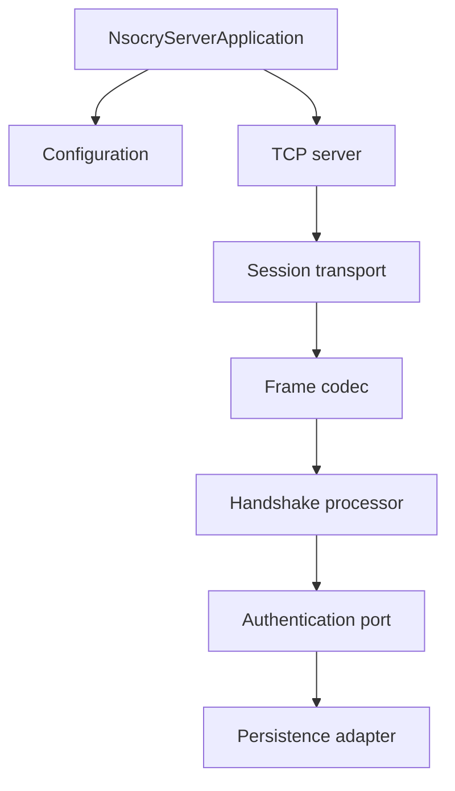
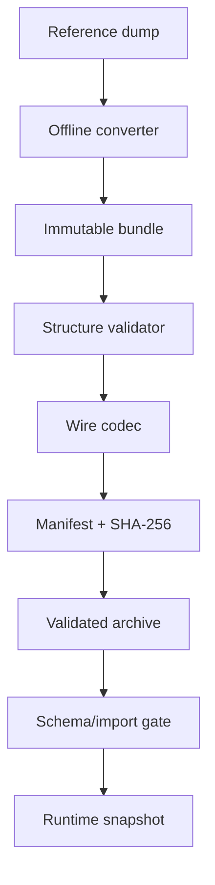

# Kiến trúc và các luồng chính

## 1. Luồng executable JAR

`NsocryLauncher` là entry point duy nhất:

1. Parse tên command và tối đa một path.
2. Chuyển command sang bootstrap class tương ứng.
3. Command tự tạo dependency ở composition boundary.
4. Command report mutation rõ ràng.

Không đặt SQL, codec hoặc gameplay rule trong launcher. Khi thêm command phải sửa đồng thời
enum, parser, switch dispatch, usage, launcher test và `runnable-jar.md`.

## 2. Luồng server/network

- Network sở hữu socket/lifecycle, không hiểu database.
- Protocol compat sở hữu wire bytes/key/frame, không hiểu account/gameplay.
- Session sở hữu phase và handshake decision.
- Authentication dùng port; JDBC chỉ nằm trong persistence.

Các luồng player/world/gameplay đầy đủ vẫn `TRACE_REQUIRED` vì client chưa vào gameplay.

## 3. Luồng client asset chung

Mỗi asset family tiến độc lập nhưng startup chỉ được publish client snapshot đầy đủ khi
DATA/MAP/SKILL/ITEM/appearance cùng sẵn sàng. Không publish snapshot bán phần.

## 4. ITEM

- Converter đọc bảng reference ITEM, dựng `ItemAssetBundle`.
- Structure validator kiểm tra ID/count/reference/range.
- Codec tạo payload client version 26.
- Artifact/manifest khóa count, length và SHA-256.
- Archive dry-run xác minh lại payload.
- V002 + importer + JDBC verifier đã VERIFIED_END_TO_END.
- Runtime composition chung vẫn chưa nối.

## 5. SKILL

- Converter dựng class → template → level → option.
- Bốn raw byte point 150/150/140/140 được bảo toàn.
- V003/import/JDBC checksum đã VERIFIED_END_TO_END.
- Runtime publish service dùng validation rồi tạo snapshot bất biến.
- Snapshot factory tính lại SHA-256; atomic store chỉ nhận snapshot hoàn chỉnh.
- Command publish hiện chỉ chứng minh luồng trong tiến trình riêng; startup chưa nối.

## 6. MAP

- Converter chỉ đưa catalog client lên payload: map name, NPC template/menu, mob template.
- Placement, zone, waypoint, spawn và animation không thuộc MAP catalog này.
- Strict JSON parser chỉ nhận `array<array<string>>` cho menu NPC.
- Artifact và archive v7 đã VERIFIED qua 233 test.
- Schema/import/runtime MAP vẫn `TRACE_REQUIRED` cho đến khi contract database được chốt.

## 7. Database safety flow

Mọi thay đổi database bắt buộc:

1. Read-only schema preflight.
2. Backup có size và SHA-256.
3. Migration draft được review.
4. Xác nhận rõ của chủ dự án.
5. Chạy migration.
6. Preflight READY.
7. Import yêu cầu checksum confirmation.
8. SQL post-check.
9. JDBC encode → checksum verification.

Thiếu bất kỳ bước nào thì trạng thái phải là PENDING/NOT_READY.
